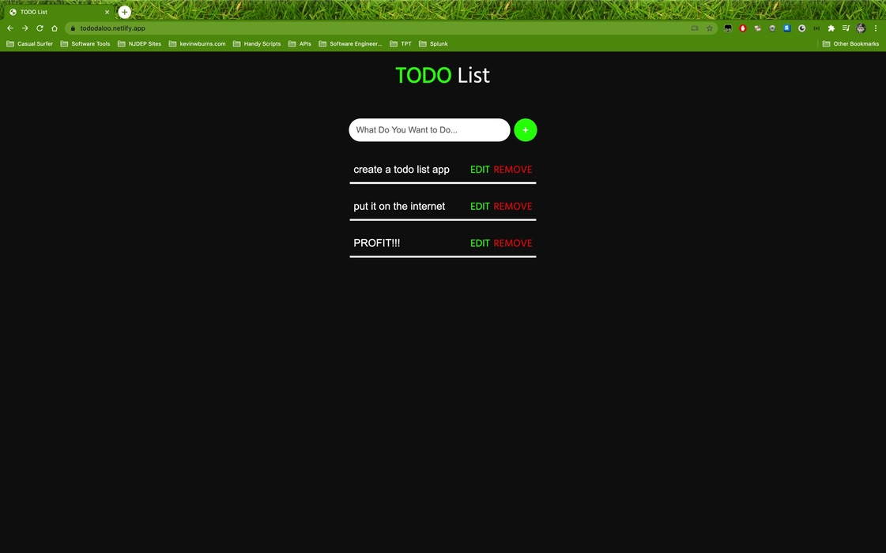

# TodoList
Todo List is a basic todo list that allows a user to add items to a list in their browser. Do your entries persist after you've closed your browser? Of course not! But then again, does the internet really need another to do app? 

So, what's the point in this app? Simple! Sometimes technical interviewers want to see examples of your JavaScript skills, but you can't show them anything of production quality because of those pesky client NDAs (amirite???). This application allows the interviewer to see that you can write JavaScript that communicates with other elements in the DOM. 





## Installation
You could clone the repo, click the download button, or just copy/paste the code into your code editor; it's only a few files. 

```bash
$ git clone https://github.com/kevintage83/todoList
```

## Usage (Windows)
```bash
cmd /c start todoList
```

## Usage (MacOS X)
```bash
open todoList
```

## Usage (Linux/Unix)
```bash
xdg-open todoList
```

## Contributing
Pull requests? No, thank you! The repo is mainly a conversation piece. Normally, if this were a repository where pull requests were welcome, I would ask that (for major changes, at least) you please open an issue first to discuss what you would like to change.

I would also ask that you please make sure to update tests as appropriate.

## License
[MIT](https://choosealicense.com/licenses/mit/)
